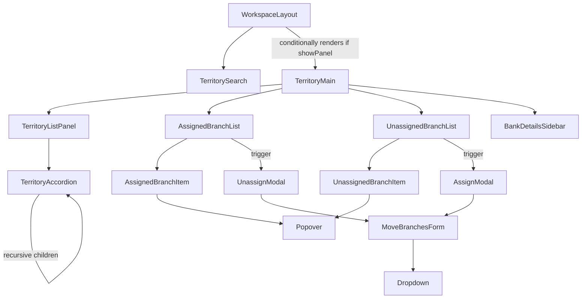

# Territory Manager Architecture Summary

This document details the architectural layout, state flow, hooks, and components used in the **Territory Hierarchy Manager** application.

---

## 1. Directory Structure

All files reside inside `src/features/territory-manager/`:

```
src/features/territory-manager/
├── components/
│   ├── common/
│   │   ├── AssignModal.tsx        # Modal for assigning unassigned branches
│   │   ├── UnassignModal.tsx      # Modal for shifting assigned branches
│   │   ├── MoveBranchesForm.tsx   # Labeled cascading picker select dropdowns
│   │   ├── Search.tsx             # Generic search input with search icon
│   │   ├── Dropdown.tsx           # Generic labeled select component
│   │   └── Popover.tsx            # Self-positioning portals-based option popup menu
│   ├── AssignedBranchItem.tsx     # Single row render logic for assigned branches
│   ├── AssignedBranchList.tsx     # Aggregates and displays filtered assigned branches
│   ├── UnassignedBranchItem.tsx   # Single row render logic for unassigned branches
│   ├── UnassignedBranchList.tsx   # Displays unassigned branches
│   ├── TerritoryAccordion.tsx     # Recursive accordion for rendering hierarchy nodes
│   ├── TerritoryListPanel.tsx     # Left-side tree search and accordion wrapper
│   ├── TerritoryMain.tsx          # 3-column workspace with top header controls
│   ├── TerritorySearch.tsx        # Global search card with radio filters
│   ├── BankDetailsSidebar.tsx     # Slide-over sidebar showing detailed bank stats
│   ├── Modal.tsx                  # Shared base modal with bootstrap layout
│   └── WorkspaceLayout.tsx        # Top-level page skeleton and page heading
├── store/
│   ├── index.ts                   # Store configuration wrapper (typed dispatch/selector hooks)
│   └── territorySlice.ts          # Central Redux slice holding state, reducers
├── types/
│   └── index.ts                   # TypeScript interfaces (nodes, branches, modals)
└── utils/
    ├── normalize.ts               # Traverses nested node structure to normalize it
    ├── usDataGenerator.ts         # Generates mock data for territories & branches
    ├── useAssignedBranches.ts     # Aggregates & filters assigned branches recursively
    └── useLazyList.ts             # Paginated rendering utilizing IntersectionObserver
```

---

## 2. State Management & Redux Design (`store/`)

We use Redux Toolkit. All state changes are pure; no components access local variables for cross-column actions.

### State Shapes in `territorySlice.ts`
- **`nodesById`**: A normalized map of `Record<number, TerritoryHierarchyNode>`. Instead of walking a deep tree recursively for every branch update, we look it up in $O(1)$ time by its `nodeId`.
- **`rootNodeIds`**: An array of top-level territory node IDs (e.g. `[101, 102]`). Used as the entry point for recursively walking the tree UI.
- **`unassignedBranches`**: Map of `Record<string, UnassignedBranch>` representing the pool of branches not yet placed in a territory.
- **`selectedTerritoryId`**: The ID of the currently selected territory. When `null`, the app views the entire organization ("USA Bank").
- **`selectedBranchIds`**: Array of branch IDs selected in either column for batch actions.
- **`globalSearchQuery`** / **`searchType`**: Determines global search status (Individual ID or Branch ID mode).
- **`showPanel`**: Visibility toggle for the 3-column layout panel.
- **`modal`**: Shared state containing `isOpen`, `title`, `type` (context of who opened it), and `meta` (optional payloads).
- **`hasUnpublishedChanges`**: Tracks whether the user made any branch movements, assignments, or deletions since the last publish event. Displays a yellow warning bar sticky to the bottom of the list.
- **`isPublishing`**: Tracks the async loading spinner state when publishing changes via the API.

### Mutating Operations
- `moveBranch` / `moveBranchesBatch`: Moves one or more branches to a target node.
- `assignBranch` / `assignBranchesBatch`: Moves branches from the unassigned pool to a target node.
- `removeBranchFromNode` / `removeBranchesBatch`: Deletes assigned branch(es) completely.
- `unassignBranch`: Unlinks a branch from a node, sending it back to the unassigned pool.
- `removeUnassignedBranch` / `removeUnassignedBranchesBatch`: Deletes unassigned branch(es) completely.

---

## 3. Core React Hooks (`utils/`)

### A. `useAssignedBranches(localSearchQuery)`
Determines what assigned branches should be visible in the middle column based on the selection and query filters.
1. **Flattening**: Aggregates all branches in the entire `nodesById` object into a flat list, tagging each branch with its parent node's ID and name.
2. **Recursive Traversal**: If `selectedTerritoryId` is not null:
   - Traverses downwards from that node, recursively collecting all branches assigned to it and all of its descendants.
3. **Query Filtering**: Filters the list by checking if the branch name or branch ID matches the `localSearchQuery` or `globalSearchQuery`.

### B. `useLazyList(items, chunkSize)`
Implements performant lazy rendering for lists with thousands of items (e.g., branches under `USA Bank`).
- Returns a slice of the input items (`visibleItems`) up to `visibleCount`.
- Uses an **IntersectionObserver** on a target ref placed at the end of the scroll list. Whenever the loader element scrolls into view, it increments `visibleCount` by `chunkSize`, keeping DOM node sizes low and interactions fluid.

---

## 4. Component Interactions



### Components Summary
- **`WorkspaceLayout.tsx`**: Sets up the navigation, header, breadcrumbs, search, and container page.
- **`TerritorySearch.tsx`**: Renders the search bar and radio inputs. Toggling or writing to these updates Redux, triggering the main panel to expand.
- **`TerritoryMain.tsx`**: Renders the top status row ("USA Bank" or territory name, view details link, and publish button) and holds the columns. Houses the glassmorphic loading screen overlay during publishing.
- **`BankDetailsSidebar.tsx`**: A sliding drawer displaying established date, active status, and territory counts for the loaded bank.
- **`TerritoryListPanel.tsx`**: Handles localized territory searching and renders the entry point for the hierarchy list. Contains the sticky unpublished warning bar.
- **`TerritoryAccordion.tsx`**: Displays a single territory node, its total branch count (calculated recursively), and its sub-nodes. Selecting a node highlights it and updates `selectedTerritoryId` in Redux.
- **`AssignedBranchList.tsx` / `UnassignedBranchList.tsx`**: Manage check-all selection checkbox, local search, and lazy paginated lists. They render sticky bottom footers containing "Delete All" and "Reassign"/"Assign" action buttons.
- **`AssignModal.tsx` / `UnassignModal.tsx`**: Popups that collect selection targets. They pass details to `MoveBranchesForm.tsx` to handle the target territory search/selection cascading.
- **`MoveBranchesForm.tsx`**: Implements cascading selects:
  - First select list lists all level 1 (root) territories.
  - Second select list is disabled until a root territory is selected; it then lists sub-territories belonging to that selected root.
